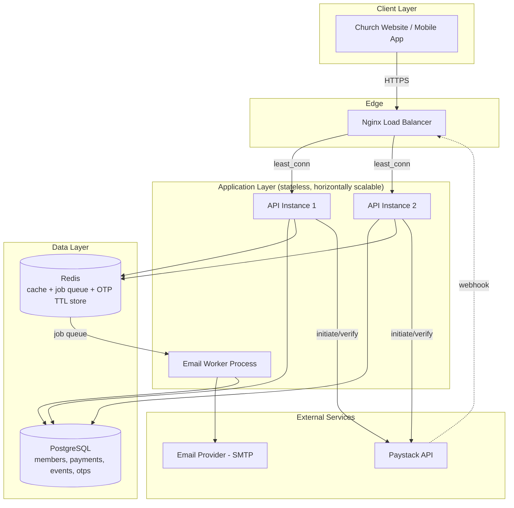

# ⛪ Church Backend API

A production-grade backend for a church website — online giving (payments), member management with **OTP-secured authentication**, transactional & bulk email, events with RSVP, and private prayer requests.

Built to be **fast**, **secure**, and **easy for any collaborator to pick up** — whether you write code every day or you're a church staff member trying to understand what this system does.

> **v1.1 update:** This version adds one-time-passcode (OTP) email verification for every new account, mandatory two-factor login for `STAFF` and `ADMIN` accounts, and a formal `STAFF` role sitting between regular members and full admins. See [Authentication & OTP](#-authentication--otp) for the full picture.

---

## 📋 Table of Contents

1. [What This System Does (Plain English)](#-what-this-system-does-plain-english)
2. [Tech Stack & Why](#-tech-stack--why)
3. [System Architecture](#-system-architecture)
4. [Folder Structure](#-folder-structure)
5. [Authentication & OTP](#-authentication--otp)
6. [Database Tooling: Prisma vs pgAdmin](#-database-tooling-prisma-vs-pgadmin)
7. [Getting Started (Clone → Run in 10 Minutes)](#-getting-started-clone--run-in-10-minutes)
8. [Environment Variables](#-environment-variables)
9. [API Reference](#-api-reference)
10. [Payments (Paystack)](#-payments-paystack)
11. [Emails & Newsletters](#-emails--newsletters)
12. [Security](#-security)
13. [Performance & Scalability](#-performance--scalability)
14. [Deployment Guide](#-deployment-guide)
15. [Testing](#-testing)
16. [Roadmap](#-roadmap)
17. [Contributing](#-contributing)

---

## 🙋 What This System Does (Plain English)

If you're not a developer, here's the short version:

- **People can give money online** (tithes, offerings, donations, event tickets) using debit/mobile money cards, and get an automatic email receipt. This runs through **Paystack**, a payment processor used widely across Africa.
- **New accounts are verified by a 6-digit code emailed to the person** — nobody can use an email address that isn't theirs, and staff/admin logins get a second code every time they sign in, like online banking.
- **The church can email members** — a verification code, a welcome email, an automatic donation receipt, or a bulk newsletter/announcement to the whole congregation — without the system slowing down or crashing, even with thousands of recipients.
- **Members can see and RSVP to upcoming events** (services, programs, conferences), and guests can RSVP too, without needing to create an account.
- **Anyone can privately submit a prayer request** to the pastoral team.
- **Three levels of access** — regular `MEMBER`, `STAFF` (day-to-day office/ministry staff), and `ADMIN` (full control) — so you can give someone limited access without handing over the keys to everything.
- Everything is built so that if 500 people visit the site during a Sunday service announcement, the site stays fast and doesn't fall over.

---

## 🛠 Tech Stack & Why

| Layer | Technology | Why |
|---|---|---|
| Runtime | **Node.js 18 LTS** | Non-blocking I/O is ideal for an API that spends most of its time waiting on the database, Redis, email providers, and Paystack. |
| Web framework | **Express.js** | Minimal, battle-tested, huge ecosystem of security middleware. |
| Database | **PostgreSQL 16** | Payments, members, RSVPs, and OTP records are relational with real constraints. ACID transactions matter for money and for "this code was used exactly once." |
| ORM | **Prisma** | Type-safe queries, auto-generated migrations, and a schema file that doubles as living documentation. |
| Cache & Queue | **Redis** | Three jobs now: (1) caching hot public data, (2) backing **BullMQ** for background email sending, and (3) **OTP hot-storage** — codes live in Redis with a native TTL so they expire automatically with zero cleanup jobs. |
| Job Queue | **BullMQ** | Bulk emails and every OTP email are sent by a background worker, so the API never blocks waiting on SMTP. |
| Payments | **Paystack** | Cards, mobile money, and bank transfers for a Ghana/West-Africa member base. |
| Auth | **JWT (access + refresh) + Argon2 + OTP (email 2FA)** | Argon2 hashes both passwords and OTP codes. Short-lived access tokens, `httpOnly` refresh cookies, and now a mandatory second factor for elevated roles. |
| Validation | **Zod** | Every request body/query/param, including every new OTP endpoint, is validated at the edge. |
| Logging | **Pino** | Structured JSON logs in production. |
| Containerization | **Docker + Docker Compose** | One command, everyone gets an identical environment. |
| Reverse proxy / Load balancer | **Nginx** | Distributes traffic across API instances. |
| Package manager | **Yarn** | Whole repo assumes `yarn`. |

**No new npm packages are required for OTP.** The whole feature is built from packages already in this stack:
- `crypto` (Node built-in) — generates the 6-digit code using a cryptographically secure random number, no extra dependency needed.
- `argon2` (already installed) — hashes the OTP the same way it hashes passwords, so a database leak never exposes usable codes.
- `ioredis` (already installed for BullMQ) — stores the code with a native `EX` expiry.
- `bullmq` + your existing SMTP worker (already installed) — sends the code without blocking the request.

If you'd prefer a small convenience helper instead of the built-in `crypto` call, `otp-generator` is a reasonable, well-maintained option:
```bash
yarn add otp-generator
```
It's genuinely optional — it just wraps the same random-number logic in a friendlier API. This project ships with the zero-dependency version.

---

## 🏗 System Architecture



**Request flow, in words:**

1. A request hits **Nginx**, which picks whichever API instance has the fewest active connections (`least_conn`).
2. Read-heavy public data (e.g. events list) is served from **Redis cache** when possible.
3. Writes go to **PostgreSQL** under real transactions.
4. Anything that sends an email — including every OTP — is queued to **Redis/BullMQ** and handled by a separate **worker process**, so the API replies immediately.
5. **Payments** go through Paystack, confirmed via a signature-verified webhook.
6. **OTP codes** are hashed with Argon2, written to Postgres (audit trail) and mirrored into Redis with a TTL (fast validity check). See the next section for the full flow.

---

## 📁 Folder Structure

```
church-backend/
├── src/
│   ├── config/              # env, database, redis, logger
│   ├── middleware/          # auth, error handling, rate limiting, security headers, validation
│   ├── modules/
│   │   ├── auth/
│   │   │   ├── auth.routes.js        # /register, /verify-otp, /resend-otp, /login, /login/verify-otp
│   │   │   ├── auth.controller.js
│   │   │   ├── auth.validation.js
│   │   │   ├── otp.service.js        # NEW — generate, hash, store, verify OTPs
│   │   │   └── token.utils.js        # NEW — access tokens + short-lived login-challenge tokens
│   │   ├── members/
│   │   ├── payments/
│   │   ├── emails/
│   │   │   └── templates/otp.template.js  # NEW — OTP email design
│   │   ├── events/
│   │   └── prayer-requests/
│   ├── utils/
│   ├── app.js
│   ├── routes.js
│   └── server.js
├── prisma/
│   ├── schema.prisma        # now includes Role (MEMBER/STAFF/ADMIN) and the Otp model
│   └── seed.js
├── docker/
├── tests/
├── .github/workflows/ci.yml
├── docker-compose.yml
└── .env.example              # now includes JWT_LOGIN_CHALLENGE_SECRET
```

---

## 🔐 Authentication & OTP

### Why OTP, and why only for STAFF/ADMIN at login

Regular members giving online or RSVPing don't need a second login step every time — that's friction most churchgoers won't tolerate. But `STAFF` and `ADMIN` accounts can view member data, mark prayer requests, and send bulk emails to the whole congregation, so they get **mandatory two-factor login**. Everyone, regardless of role, still verifies their email once at sign-up — that alone stops fake/typo'd email addresses and throwaway accounts.

### Roles

| Role | Can do | Login requires OTP? |
|---|---|---|
| `MEMBER` | Give, RSVP, submit prayer requests, view own profile/payment history | No (only at registration) |
| `STAFF` | Everything a member can do, plus: view members, send newsletters, manage events, view/resolve prayer requests | **Yes, every login** |
| `ADMIN` | Everything staff can do, plus: create/disable other STAFF and ADMIN accounts, full system configuration | **Yes, every login** |

### Flow 1 — Registration (every role)

```
POST /auth/register  { fullName, email, phone?, password }
  → account created with isVerified = false
  → 6-digit OTP generated, Argon2-hashed, stored in Redis (10 min TTL) + Postgres (audit)
  → OTP emailed via the background worker
  ← 201 { userId, email }

POST /auth/verify-otp  { userId, code }
  → checks the hash, marks the OTP consumed (single-use), sets isVerified = true
  ← 200 "Email verified. You can now log in."

POST /auth/resend-otp  { userId, purpose }
  → issues a new code (1-per-minute cooldown, 5 wrong-attempt cap per code)
```

### Flow 2 — Login for a `MEMBER`

```
POST /auth/login  { email, password }
  → password checked, account must be isVerified + isActive
  ← 200 { accessToken, user }   // refreshToken set as httpOnly cookie
```

### Flow 3 — Login for `STAFF` / `ADMIN` (mandatory 2FA)

```
POST /auth/login  { email, password }
  → password checked
  → a second OTP is generated and emailed (purpose: LOGIN_2FA)
  → a short-lived "loginChallengeToken" (5 min, proves password already checked,
    carries no permissions on its own) is returned instead of real tokens
  ← 200 { requiresOtp: true, loginChallengeToken }

POST /auth/login/verify-otp  { loginChallengeToken, code }
  → verifies the code, then issues the real accessToken + refreshToken cookie
  ← 200 { accessToken, user }
```

### Security details worth knowing

- **Codes are never stored in plaintext**, in Redis or Postgres — only an Argon2 hash.
- **Single-use**: a code is marked `consumedAt` the moment it's verified and deleted from Redis immediately, so replaying it fails even within the 10-minute window.
- **Brute-force capped**: 5 wrong guesses on one code invalidates it; the OTP endpoints also sit behind a stricter Redis-backed rate limiter (10 requests / 10 minutes) than the rest of the API.
- **Resend cooldown**: 60 seconds between requests for the same user + purpose, preventing email-bombing.
- **`loginChallengeToken` is not an access token** — it's signed with its own secret (`JWT_LOGIN_CHALLENGE_SECRET`) and grants no API access; it only proves "this user's password was correct 5 minutes ago."

---

## 🗄 Database Tooling: Prisma vs pgAdmin

Short answer: **this isn't an either/or choice — they solve different problems, and you should use both.**

| | **Prisma** | **pgAdmin** |
|---|---|---|
| What it is | An ORM + migration tool your *code* talks to | A GUI application for *humans* to browse a Postgres database |
| Where user tables come from | `prisma/schema.prisma` defines every table (`User`, `Otp`, `Payment`, `Event`...); `yarn prisma:migrate` creates/updates them | Nothing — it doesn't create your schema, it just shows you what's already there |
| Best for | Defining the data model once, in version control, with type-safe queries in your Node code | Poking around: "let me quickly check if this member's row updated," running an ad-hoc SQL query, visually inspecting data during a demo |

**Recommendation for this project:** keep **Prisma as the single source of truth** for the schema and all migrations (that's what `prisma/schema.prisma` and the `Otp`/`Role` additions above are). Use **pgAdmin only as an optional viewing tool** if you like a desktop GUI for glancing at data.

Even simpler than installing pgAdmin separately: Prisma ships its own browser-based GUI for free.
```bash
yarn prisma studio
```
This opens a local web UI where you can browse/edit every table Prisma manages — including the new `Otp` table — with zero extra installation. Most teams on this stack only reach for pgAdmin later, for heavier SQL debugging or connecting a BI tool; for day-to-day "let me look at this row," `prisma studio` is the faster option.

---

## 🚀 Getting Started (Clone → Run in 10 Minutes)

### Prerequisites

- [Node.js 18+](https://nodejs.org)
- [Yarn](https://yarnpkg.com) (`npm install -g yarn`)
- [Docker & Docker Compose](https://www.docker.com/products/docker-desktop) (recommended)
- A free [Paystack test account](https://dashboard.paystack.com/#/signup)
- An SMTP provider — [SendGrid](https://sendgrid.com), [Mailgun](https://www.mailgun.com), or a Gmail App Password for local testing (this is also what sends your OTP emails)

### Option A — Run everything with Docker (recommended)

```bash
git clone https://github.com/TawiahObedCodeX/LBC-BACKEND.git
cd church-backend

cp .env.example .env
# → fill in PAYSTACK keys, SMTP credentials, and generate random secrets for
#   JWT_ACCESS_SECRET / JWT_REFRESH_SECRET / JWT_LOGIN_CHALLENGE_SECRET / COOKIE_SECRET

docker compose up --build

# In a NEW terminal — apply migrations (creates the new Role enum + Otp table too) and seed
docker compose exec api yarn prisma:deploy
docker compose exec api yarn seed
```

API live at **http://localhost**. `curl http://localhost/health` → `{"status":"ok", ...}`

**Default admin login (from seed):** `[email protected]` / `Admin@12345` — change immediately. Because `ADMIN` now requires 2FA, the seed script also seeds a verified email so you can complete the OTP login step on the very first run — check the console output from `yarn seed` for the code if you haven't wired up a real SMTP provider yet.

> 💡 **Tip — generating strong secrets:** run `node -e "console.log(require('crypto').randomBytes(64).toString('hex'))"` once per secret, including the new `JWT_LOGIN_CHALLENGE_SECRET`.

### Option B — Run locally without Docker

```bash
git clone https://github.com/TawiahObedCodeX/LBC-BACKEND.git
cd church-backend
yarn install

cp .env.example .env
# → fill in .env

yarn prisma:migrate
yarn seed

yarn dev                 # API with hot-reload on http://localhost:5000

# second terminal — required for OTP emails and newsletters to actually send
yarn worker:email
```

### Verifying it worked

```bash
curl http://localhost:5000/health

# Register — triggers an OTP email
curl -X POST http://localhost:5000/api/v1/auth/register \
  -H "Content-Type: application/json" \
  -d '{"fullName":"Jane Doe","email":"[email protected]","password":"Passw0rd!"}'

# Verify with the code from the email
curl -X POST http://localhost:5000/api/v1/auth/verify-otp \
  -H "Content-Type: application/json" \
  -d '{"userId":"<id from register response>","code":"123456"}'

curl http://localhost:5000/api/v1/events
```

---

## 🔑 Environment Variables

| Variable | Purpose |
|---|---|
| `DATABASE_URL` | PostgreSQL connection string (Prisma format) |
| `REDIS_URL` | Redis connection string — now also backs OTP storage |
| `JWT_ACCESS_SECRET` / `JWT_REFRESH_SECRET` | Signing secrets for the real session tokens |
| `JWT_LOGIN_CHALLENGE_SECRET` | **NEW** — separate secret for the short-lived token used between password check and OTP verification for STAFF/ADMIN logins |
| `PAYSTACK_SECRET_KEY` / `PAYSTACK_PUBLIC_KEY` | From your Paystack dashboard |
| `SMTP_HOST/PORT/USER/PASS` | Your email provider's credentials — sends OTPs, receipts, and newsletters |
| `CORS_ALLOWED_ORIGINS` | Frontend domains allowed to call this API |
| `RATE_LIMIT_WINDOW_MS` / `RATE_LIMIT_MAX` | General API rate-limit tuning |
| `OTP_TTL_SECONDS` *(optional, defaults to 600)* | How long a code stays valid |

All variables are documented in `.env.example`. Never commit your real `.env` file.

---

## 📡 API Reference

Base URL: `/api/v1`. Every response follows:
```json
{ "success": true, "message": "...", "data": { } }
```

| Method | Endpoint | Auth | Description |
|---|---|---|---|
| POST | `/auth/register` | Public | Create an account (unverified until OTP confirms email) |
| POST | `/auth/verify-otp` | Public | Confirm the registration OTP, activates the account |
| POST | `/auth/resend-otp` | Public | Resend an OTP for a given purpose (rate-limited) |
| POST | `/auth/login` | Public | Password check. Members get tokens immediately; STAFF/ADMIN get a `loginChallengeToken` and an OTP email instead |
| POST | `/auth/login/verify-otp` | Public (requires `loginChallengeToken`) | Completes STAFF/ADMIN login, issues real tokens |
| POST | `/auth/refresh` | Cookie | Exchange refresh cookie for a new access token |
| POST | `/auth/logout` | Member | Invalidate the current refresh token |
| GET | `/members` | Staff/Admin | Paginated, searchable member list |
| GET | `/members/me` | Member | Current user's profile |
| PATCH | `/members/me` | Member | Update own profile |
| POST | `/payments/initiate` | Public | Start a payment, returns Paystack checkout URL |
| GET | `/payments/verify/:reference` | Public | Verify a transaction by reference |
| POST | `/payments/webhook` | Paystack only (signature-verified) | Receives payment confirmation events |
| GET | `/payments/history` | Member | Logged-in member's own payment history |
| POST | `/emails/bulk` | Staff/Admin | Send a newsletter/announcement to all members or a custom list |
| GET | `/events` | Public | List upcoming events (cached) |
| POST | `/events` | Staff/Admin | Create an event |
| POST | `/events/:eventId/rsvp` | Public | RSVP to an event (member or guest) |
| POST | `/prayer-requests` | Public | Submit a private prayer request |
| GET | `/prayer-requests` | Staff/Admin | View submitted prayer requests |
| PATCH | `/prayer-requests/:id/resolve` | Staff/Admin | Mark a request as prayed for/resolved |
| POST | `/staff` | Admin only | Create a new STAFF account (admin sets a temp password; the new staff member still verifies by OTP on first login) |
| PATCH | `/staff/:id/disable` | Admin only | Deactivate a STAFF or MEMBER account (`isActive = false`) |

---

## 💳 Payments (Paystack)

1. **Initiate** — the client calls `POST /payments/initiate` with an amount, purpose (`tithe`/`offering`/`donation`/`event-ticket`), and optional member ID. The API asks Paystack to create a transaction and returns a checkout URL.
2. **Redirect** — the browser sends the person to that Paystack-hosted checkout page to enter card or mobile money details. Card/mobile money numbers never touch this backend directly.
3. **Confirm** — Paystack calls back to `POST /payments/webhook`. The signature is verified with HMAC-SHA512 against the raw request body before anything is trusted.
4. **Idempotency** — a Redis lock keyed on the Paystack event ID prevents the same webhook (which can legitimately arrive more than once) from creating a duplicate payment record or sending two receipts.
5. **Receipt** — on confirmed success, a receipt email is queued (same BullMQ pattern as OTPs) and the payment is recorded against the member's history, viewable at `GET /payments/history`.

---

## 📧 Emails & Newsletters

All outbound email — OTP codes, welcome emails, payment receipts, and bulk newsletters — goes through the same pipeline:

```
API enqueues a job on Redis/BullMQ  →  Worker process picks it up  →  SMTP send (with retries)
```

- **Transactional** (OTP, receipts, welcome): enqueued one at a time, delivered in seconds.
- **Bulk newsletter** (`POST /emails/bulk`, Staff/Admin only): the API doesn't loop and send 2,000 emails synchronously — it enqueues one job per recipient (or per batch, depending on your SMTP provider's bulk-send limits) so the request returns instantly and the worker paces sends according to the provider's rate limits.
- **Templates** live in `src/modules/emails/templates/` — plain JS functions returning HTML strings, so no separate templating engine is required. `otp.template.js` is the newest addition here.

---

## 🔐 Security

- **Helmet** — 15+ secure HTTP headers.
- **CORS whitelist** — only origins in `CORS_ALLOWED_ORIGINS`.
- **Redis-backed rate limiting** — general limits everywhere, stricter limits on `/auth/*`, `/payments/initiate`, and now the OTP endpoints specifically.
- **Argon2id** — hashes both passwords **and OTP codes**.
- **JWT access + refresh + login-challenge tokens** — three distinct token types, each scoped to exactly what it's allowed to prove.
- **Mandatory 2FA for STAFF/ADMIN** — the highest-privilege accounts can't be logged into with a password alone, even if that password leaks.
- **Input validation everywhere (Zod)**, including every OTP payload.
- **HPP protection**, **NoSQL-injection & XSS sanitization**, **webhook signature verification**, **10kb payload cap**, **non-root Docker container**, **env validation at boot**, **idempotent payment processing** — unchanged from v1.

### Recommended additions before going fully live

- A Web Application Firewall in front of Nginx (Cloudflare's free tier)
- SMS OTP as a fallback channel for staff/admin (Twilio — already on the roadmap)
- Automated dependency vulnerability scanning (`yarn audit` in CI, or Dependabot)
- Regular encrypted database backups

---

## ⚡ Performance & Scalability

1. **Stateless API instances** — no in-memory session state, so Nginx can distribute across any number of instances.
2. **Redis caching** — hot public data cached ~60 seconds.
3. **Background job queue (BullMQ)** — every email, including OTPs and newsletters, is offloaded to a worker.
4. **OTP hot-path in Redis** — checking code validity is a Redis lookup, not a Postgres query, keeping login/registration snappy even under load.
5. **Connection pooling via Prisma**.
6. **Gzip compression** at both Express and Nginx.
7. **`least_conn` load-balancing**.
8. **Database indexing** — `email`, payment `reference`/`status`, and now `Otp(userId, purpose)` are all indexed.

---

## ☁️ Deployment Guide

### Railway or Render (recommended for a church-sized budget)

1. Push this repo to GitHub.
2. Create a project → "Deploy from GitHub repo."
3. Add **PostgreSQL** and **Redis** add-ons; copy connection strings into `DATABASE_URL` / `REDIS_URL`.
4. Set every variable from `.env.example`, including the new `JWT_LOGIN_CHALLENGE_SECRET`.
5. Build command: `yarn install && yarn prisma:generate`. Start command: `yarn prisma:deploy && yarn start`.
6. Deploy a **second service** running `yarn worker:email` — this now also carries all OTP email traffic.
7. Point your Paystack webhook URL to `https://your-deployed-domain.com/api/v1/payments/webhook`.

### AWS (larger scale)

- **Compute:** ECS Fargate behind an Application Load Balancer.
- **Database:** RDS for PostgreSQL (Multi-AZ when budget allows).
- **Cache/Queue:** ElastiCache for Redis (also holds OTP TTLs).
- **Email worker:** separate ECS service, scaled on queue depth.
- **Secrets:** AWS Secrets Manager instead of a plain `.env`.

### Production checklist

- [ ] Real Paystack keys, webhook URL registered
- [ ] `NODE_ENV=production`
- [ ] Strong, unique value for every secret — **including `JWT_LOGIN_CHALLENGE_SECRET`**
- [ ] HTTPS enforced
- [ ] Database backups scheduled
- [ ] `docker compose exec api yarn prisma:deploy` run before first traffic (creates the `Role` enum and `Otp` table)
- [ ] Confirm the SMTP provider's sending limits comfortably cover OTP volume + newsletters combined

---

## 🧪 Testing

```bash
yarn test         # Jest + Supertest, including OTP issue/verify/expiry/brute-force cases
yarn lint
yarn lint:fix
```

CI (`.github/workflows/ci.yml`) runs both on every push/PR with real Postgres and Redis service containers.

---

## 🗺 Roadmap

- [x] OTP email verification on registration
- [x] Mandatory 2FA login for STAFF/ADMIN
- [x] Formal `STAFF` role
- [ ] SMS OTP fallback (Twilio) alongside email
- [ ] Sermon/media library (S3 + CloudFront)
- [ ] Small groups / ministry team management
- [ ] Recurring/scheduled giving (subscriptions via Paystack)
- [ ] Admin analytics dashboard
- [ ] Multi-language email templates (including OTP templates)

---

## 🤝 Contributing

1. Branch off `develop`: `git checkout -b feature/your-feature-name`
2. Follow the existing module structure — new features get their own folder under `src/modules/`
3. Run `yarn lint` and `yarn test` before opening a pull request
4. Open a PR into `develop` with a clear description

If you're new to the codebase, start with `prisma/schema.prisma` (data model, including `Role` and `Otp`), `src/app.js` (request pipeline), and `src/modules/auth/otp.service.js` (the new OTP logic).

---

## 📄 License

MIT — free to use and adapt for your ministry.
