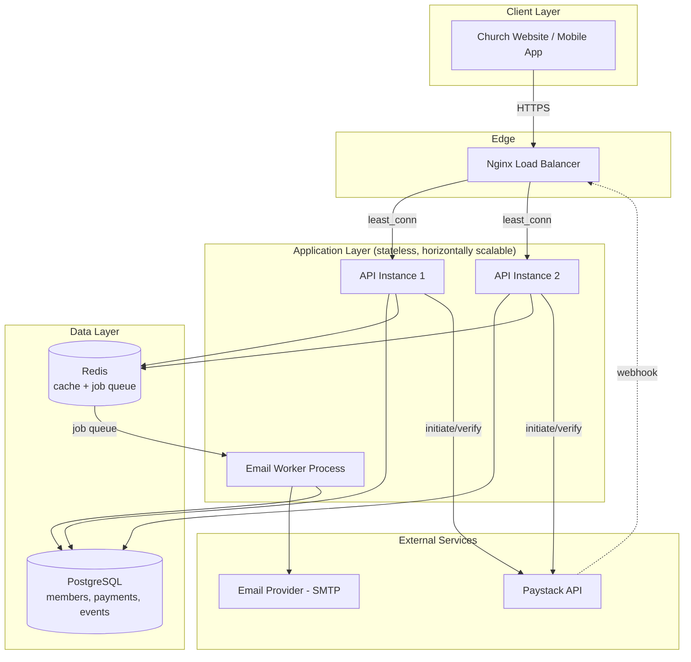

# ⛪ Church Backend API

A production-grade backend for a church website — online giving (payments), member management, transactional & bulk email, events with RSVP, and private prayer requests.

Built to be **fast**, **secure**, and **easy for any collaborator to pick up** — whether you write code every day or you're a church staff member trying to understand what this system does.

---

## 📋 Table of Contents

1. [What This System Does (Plain English)](#-what-this-system-does-plain-english)
2. [Tech Stack & Why](#-tech-stack--why)
3. [System Architecture](#-system-architecture)
4. [Folder Structure](#-folder-structure)
5. [Getting Started (Clone → Run in 10 Minutes)](#-getting-started-clone--run-in-10-minutes)
6. [Environment Variables](#-environment-variables)
7. [API Reference](#-api-reference)
8. [Security](#-security)
9. [Performance & Scalability](#-performance--scalability)
10. [Deployment Guide](#-deployment-guide)
11. [Testing](#-testing)
12. [Roadmap](#-roadmap)
13. [Contributing](#-contributing)

---

## 🙋 What This System Does (Plain English)

If you're not a developer, here's the short version:

- **People can give money online** (tithes, offerings, donations, event tickets) using debit/mobile money cards, and get an automatic email receipt. This runs through **Paystack**, a payment processor used widely across Africa.
- **The church can email members** — either one welcome email when someone signs up, an automatic donation receipt, or a bulk newsletter/announcement to the whole congregation — without the system slowing down or crashing, even if there are thousands of recipients.
- **Members can see and RSVP to upcoming events** (services, programs, conferences), and guests can RSVP too, without needing to create an account.
- **Anyone can privately submit a prayer request** to the pastoral team — a feature added beyond the original scope because it's a natural fit for a church platform.
- Everything is built so that if 500 people visit the site during a Sunday service announcement, the site stays fast and doesn't fall over — that's what the "load balancing," "caching," and "queues" mentioned below actually do for you in practice.

---

## 🛠 Tech Stack & Why

You proposed **Node.js, PostgreSQL, Redis, Express.js** — that instinct is correct, and it's exactly what's used here. Below is the full stack with the reasoning, so you know *why* each piece was chosen and not just *what* it is.

| Layer | Technology | Why |
|---|---|---|
| Runtime | **Node.js 18 LTS** | Non-blocking I/O is ideal for an API that spends most of its time waiting on the database, Redis, email providers, and Paystack — not doing heavy CPU work. |
| Web framework | **Express.js** | Minimal, battle-tested, huge ecosystem of security middleware (helmet, hpp, rate-limit, etc.) used below. |
| Database | **PostgreSQL 16** | Payments, member records, and RSVPs are inherently relational data with real constraints (a payment belongs to one user, an RSVP belongs to one event). Postgres gives you ACID transactions — critical for money — which a NoSQL store does not guarantee out of the box. |
| ORM | **Prisma** | Type-safe queries, auto-generated migrations, and a schema file (`prisma/schema.prisma`) that doubles as living documentation of your entire data model — a non-technical stakeholder can literally read it. |
| Cache & Queue | **Redis** | Two jobs: (1) **caching** hot, frequently-read data like the public "upcoming events" list, so repeat requests don't hit Postgres every time, and (2) backing **BullMQ**, the job queue used for sending emails asynchronously (see [Performance](#-performance--scalability)). |
| Job Queue | **BullMQ** | Bulk emails (e.g., a newsletter to 2,000 members) are processed in the background by a separate worker process, so the API never blocks or times out. |
| Payments | **Paystack** | Chosen as the default given a Ghana/West-Africa member base — supports cards, mobile money, and bank transfers. The integration is isolated in one file (`paystack.client.js`) so swapping to Stripe/Flutterwave later is a small, contained change. |
| Auth | **JWT (access + refresh tokens) + Argon2** | Argon2 (winner of the 2015 Password Hashing Competition) is more resistant to modern cracking hardware than bcrypt. Short-lived access tokens + httpOnly refresh cookies limit the damage if a token ever leaks. |
| Validation | **Zod** | Every request body/query/param is validated at the edge before it touches business logic — blocking malformed and malicious input by default. |
| Logging | **Pino** | Structured JSON logs in production (machine-readable, ready for log aggregators like Datadog/CloudWatch), pretty colorized logs in development. |
| Containerization | **Docker + Docker Compose** | Guarantees "it works on my machine" becomes "it works on every machine" — collaborators run one command and get Postgres, Redis, the API, the worker, and Nginx all wired together correctly. |
| Reverse proxy / Load balancer | **Nginx** | Distributes incoming traffic across multiple API instances (see `docker/nginx.conf`), and can later be swapped for a managed load balancer (AWS ALB, etc.) in production. |
| Package manager | **Yarn** | As requested — the whole repo assumes `yarn`, and a `yarn.lock` file (generated on your first install) locks exact dependency versions for every collaborator. |

This is a deliberately "boring," proven stack — for a system handling real people's money and personal data, boring and battle-tested beats trendy and unproven.

---

## 🏗 System Architecture



**Request flow, in words:**

1. A request hits **Nginx**, which picks whichever API instance has the fewest active connections (`least_conn`) and forwards it — this is the "load balancing" you asked about.
2. The API instance handles the request. If it needs data that rarely changes (e.g. the public events list), it checks **Redis first** — a cache hit returns in a few milliseconds without touching Postgres at all.
3. For anything that writes real data (a new member, a payment record), it goes to **PostgreSQL**, which enforces data integrity with real transactions.
4. If the request needs to **send an email** (welcome email, receipt, bulk newsletter), the API doesn't send it itself — it drops a lightweight job onto a **Redis-backed queue** and responds to the user immediately. A separate **worker process** picks up queued jobs and does the actual (slower) work of talking to the SMTP provider, retrying automatically if it fails.
5. **Payments** go through Paystack: the API asks Paystack to create a transaction, redirects the user there to pay, and then Paystack calls back to our **webhook** endpoint to confirm success — which we verify using a cryptographic signature before trusting it.

---

## 📁 Folder Structure

```
church-backend/
├── src/
│   ├── config/              # env, database, redis, logger — all app-wide setup in one place
│   ├── middleware/          # auth, error handling, rate limiting, security headers, validation
│   ├── modules/             # one folder per business feature (a "vertical slice" architecture)
│   │   ├── auth/            # register, login, refresh, logout
│   │   ├── members/         # member profiles, admin member listing
│   │   ├── payments/        # Paystack integration, webhook, payment history
│   │   ├── emails/          # queue, worker, HTML templates, bulk-send endpoint
│   │   ├── events/          # event creation, public listing, RSVP
│   │   └── prayer-requests/ # bonus feature — private prayer request submissions
│   ├── utils/               # ApiError, ApiResponse, catchAsync — shared building blocks
│   ├── app.js               # Express app + middleware pipeline (no server binding here — testable)
│   ├── routes.js            # mounts every module's routes under /api/v1
│   └── server.js            # boots the HTTP server, handles graceful shutdown
├── prisma/
│   ├── schema.prisma        # the entire data model — read this to understand what data we store
│   └── seed.js              # creates a default admin + sample event for local testing
├── docker/
│   ├── Dockerfile           # multi-stage build → small, non-root, production image
│   └── nginx.conf           # load-balancer / reverse-proxy config
├── tests/                   # Jest + Supertest
├── .github/workflows/ci.yml # automated lint + test on every push/PR
├── docker-compose.yml       # one command spins up Postgres + Redis + API + worker + Nginx
└── .env.example             # every environment variable you need, documented
```

**Why "modules" instead of the classic `controllers/`, `services/`, `models/` split across the whole app?**
Each feature (auth, payments, emails...) is self-contained — its routes, controller, service, and validation live together. A new collaborator working on "events" only needs to open the `events/` folder, not hunt across five top-level directories. This scales much better as the app grows.

---

## 🚀 Getting Started (Clone → Run in 10 Minutes)

### Prerequisites

- [Node.js 18+](https://nodejs.org)
- [Yarn](https://yarnpkg.com) (`npm install -g yarn`)
- [Docker & Docker Compose](https://www.docker.com/products/docker-desktop) (recommended — handles Postgres & Redis for you)
- A free [Paystack test account](https://dashboard.paystack.com/#/signup) (for payment testing)
- An SMTP provider — [SendGrid](https://sendgrid.com), [Mailgun](https://www.mailgun.com), or even a Gmail App Password for local testing

### Option A — Run everything with Docker (recommended for first-time setup)

```bash
# 1. Clone the repo
git clone https://github.com/TawiahObedCodeX/LBC-BACKEND.git or SHH  git@github.com:TawiahObedCodeX/LBC-BACKEND.git
cd church-backend

# 2. Copy the environment template and fill in your real secrets
cp .env.example .env
# → open .env and fill in PAYSTACK keys, SMTP credentials, and generate random secrets for
#   JWT_ACCESS_SECRET / JWT_REFRESH_SECRET / COOKIE_SECRET (see tip below)

# 3. Start everything: Postgres, Redis, 2 API instances, the email worker, and Nginx
docker compose up --build

# 4. In a NEW terminal, run migrations and seed a default admin account
docker compose exec api yarn prisma:deploy
docker compose exec api yarn seed
```

The API is now live at **http://localhost** (Nginx load-balancing across two API instances).
Try it: `curl http://localhost/health` → `{"status":"ok", ...}`

**Default admin login (from the seed script):** `[email protected]` / `Admin@12345` — change this immediately in any real deployment.

> 💡 **Tip — generating strong secrets:** run `node -e "console.log(require('crypto').randomBytes(64).toString('hex'))"` three times to generate values for `JWT_ACCESS_SECRET`, `JWT_REFRESH_SECRET`, and `COOKIE_SECRET`.

### Option B — Run locally without Docker (Postgres/Redis installed on your machine)

```bash
git clone https://github.com/TawiahObedCodeX/LBC-BACKEND.git or SHH git@github.com:TawiahObedCodeX/LBC-BACKEND.git
cd church-backend
yarn install

cp .env.example .env
# → fill in .env, pointing DATABASE_URL and REDIS_URL at your local instances

yarn prisma:migrate     # creates the database tables
yarn seed                # optional — creates a default admin + sample event

yarn dev                 # starts the API with hot-reload on http://localhost:5000

# In a second terminal — start the email worker (required for any email to actually send)
yarn worker:email
```

### Verifying it worked

```bash
# Health check
curl http://localhost:5000/health

# Register a member
curl -X POST http://localhost:5000/api/v1/auth/register \
  -H "Content-Type: application/json" \
  -d '{"fullName":"Jane Doe","email":"[email protected]","password":"Passw0rd!"}'

# List upcoming events (public)
curl http://localhost:5000/api/v1/events
```

If you see JSON responses back (not connection errors), you're good to go.

---

## 🔑 Environment Variables

All variables are documented with comments in [`.env.example`](./.env.example). Copy it to `.env` and fill in real values before running anything. Never commit your real `.env` file — it's already in `.gitignore`.

| Variable | Purpose |
|---|---|
| `DATABASE_URL` | PostgreSQL connection string (Prisma format) |
| `REDIS_URL` | Redis connection string |
| `JWT_ACCESS_SECRET` / `JWT_REFRESH_SECRET` | Signing secrets for auth tokens — must be long, random, and never shared |
| `PAYSTACK_SECRET_KEY` / `PAYSTACK_PUBLIC_KEY` | From your Paystack dashboard — use `sk_test_...` keys while developing |
| `SMTP_HOST/PORT/USER/PASS` | Your email provider's credentials |
| `CORS_ALLOWED_ORIGINS` | Comma-separated list of frontend domains allowed to call this API |
| `RATE_LIMIT_WINDOW_MS` / `RATE_LIMIT_MAX` | General API rate-limit tuning |

---

## 📡 API Reference

Base URL: `/api/v1`. Every response follows the same shape:

```json
{ "success": true, "message": "...", "data": { } }
```

| Method | Endpoint | Auth | Description |
|---|---|---|---|
| POST | `/auth/register` | Public | Create a member account |
| POST | `/auth/login` | Public | Log in, receive access token + refresh cookie |
| POST | `/auth/refresh` | Cookie | Exchange refresh cookie for a new access token |
| POST | `/auth/logout` | Member | Invalidate the current refresh token |
| GET | `/members` | Admin/Staff | Paginated, searchable member list |
| GET | `/members/me` | Member | Current user's profile |
| PATCH | `/members/me` | Member | Update own profile |
| POST | `/payments/initiate` | Public | Start a payment (tithe/offering/donation/etc.), returns Paystack checkout URL |
| GET | `/payments/verify/:reference` | Public | Verify a transaction by reference |
| POST | `/payments/webhook` | Paystack only (signature-verified) | Receives payment confirmation events |
| GET | `/payments/history` | Member | Logged-in member's own payment history |
| POST | `/emails/bulk` | Admin/Staff | Send a newsletter/announcement to all members or a custom list |
| GET | `/events` | Public | List upcoming events (cached) |
| POST | `/events` | Admin/Staff | Create an event |
| POST | `/events/:eventId/rsvp` | Public | RSVP to an event (member or guest) |
| POST | `/prayer-requests` | Public | Submit a private prayer request |
| GET | `/prayer-requests` | Admin/Staff | View submitted prayer requests |
| PATCH | `/prayer-requests/:id/resolve` | Admin/Staff | Mark a request as prayed for/resolved |

---

## 🔐 Security

Security is treated as non-negotiable for a system touching money and personal data. Here's what's implemented and why:

- **Helmet** — sets 15+ secure HTTP headers (Content-Security-Policy, HSTS, X-Content-Type-Options, etc.) to block common browser-based attacks.
- **CORS whitelist** — only origins listed in `CORS_ALLOWED_ORIGINS` can call the API from a browser; everything else is rejected.
- **Redis-backed rate limiting** — general limits on all API routes, much stricter limits on `/auth/*` (prevents brute-forcing passwords) and `/payments/initiate` (prevents abuse). Backed by Redis so limits hold correctly even across multiple load-balanced instances.
- **Argon2id password hashing** — stronger against modern cracking hardware than bcrypt.
- **JWT access + refresh token pattern** — short-lived (15 min) access tokens limit the blast radius if one leaks; refresh tokens are stored as `httpOnly`, `sameSite=strict` cookies, invisible to JavaScript (blocks XSS-based token theft), and can be revoked server-side instantly.
- **Input validation everywhere (Zod)** — every request body/query/param is validated and type-coerced before touching business logic.
- **HPP protection** — strips HTTP Parameter Pollution attempts (duplicate query keys used to bypass validation).
- **NoSQL-injection & XSS sanitization** — `express-mongo-sanitize` and `xss-clean` strip dangerous operators/scripts from all input.
- **Paystack webhook signature verification** — every webhook call is validated with an HMAC-SHA512 signature against the raw request body before being trusted. Without this, anyone could POST a fake "payment successful" event.
- **Payload size limits** — request bodies capped at 10kb, mitigating basic denial-of-service via oversized payloads.
- **Non-root Docker container** — the app runs as an unprivileged user inside its container, limiting damage if the container is ever compromised.
- **Environment variable validation at boot (Zod)** — the app refuses to start if required secrets are missing or malformed, preventing accidental misconfiguration in production.
- **Centralized, leak-proof error handling** — stack traces and internal details are only ever shown in development; production error responses are generic and safe.
- **Idempotent payment processing** — a Redis lock prevents the same Paystack webhook event (which can legitimately arrive more than once) from being processed twice.

### Recommended additions before going fully live (not included by default, but easy to layer on)

- A Web Application Firewall in front of Nginx (Cloudflare's free tier is a strong, easy option)
- Two-factor authentication for `ADMIN`/`STAFF` accounts
- Automated dependency vulnerability scanning (`yarn audit` in CI, or GitHub Dependabot — enable it under repo Settings → Security)
- Regular encrypted database backups (most managed Postgres providers offer this out of the box)

---

## ⚡ Performance & Scalability

This directly addresses "the load balancer will be working fast" and "speed of request/response at business scale":

1. **Stateless API instances** — the API stores no session state in memory (auth state lives in the JWT/DB), so Nginx can distribute traffic across any number of identical instances (`deploy.replicas` in `docker-compose.yml`, or auto-scaling groups in the cloud) with zero risk of "sticky session" bugs.
2. **Redis caching** — hot, read-heavy public data (like the upcoming-events list) is cached for 60 seconds, so a Sunday-morning traffic spike hits Redis (sub-millisecond) instead of PostgreSQL.
3. **Background job queue (BullMQ)** — anything slow (sending emails, especially bulk newsletters) is offloaded to a separate worker process. The API responds in milliseconds regardless of whether you're emailing 1 person or 5,000.
4. **Connection pooling via Prisma** — a single shared database client is reused across all requests instead of opening a new connection each time, which would exhaust Postgres quickly under load.
5. **Gzip compression** — both at the Express level and at Nginx, shrinking JSON payloads sent to clients.
6. **`least_conn` load-balancing algorithm** — Nginx sends each new request to whichever backend instance is least busy, rather than blindly round-robining, which handles uneven request costs (a webhook vs. a simple GET) better.
7. **Database indexing** — the Prisma schema indexes the columns actually queried on (`email`, payment `reference`, `status`) so lookups stay fast as tables grow into the hundreds of thousands of rows.

---

## ☁️ Deployment Guide

### Recommended path for a church-sized budget: Railway or Render

Both offer managed PostgreSQL + Redis add-ons and deploy directly from a GitHub repo with zero server management.

1. Push this repo to GitHub.
2. On [Railway](https://railway.app) or [Render](https://render.com): create a new project → "Deploy from GitHub repo."
3. Add a **PostgreSQL** and a **Redis** add-on/instance from their marketplace — copy the connection strings into your service's environment variables as `DATABASE_URL` and `REDIS_URL`.
4. Set all other variables from `.env.example` in the platform's environment variable settings.
5. Set the build command to `yarn install && yarn prisma:generate` and the start command to `yarn prisma:deploy && yarn start`.
6. Deploy a **second service** (same repo) running `yarn worker:email` — this is your background email worker.
7. Point your Paystack dashboard's webhook URL to `https://your-deployed-domain.com/api/v1/payments/webhook`.

### Path for larger scale / more control: AWS

- **Compute:** ECS Fargate (or EC2 + PM2) running the Docker image built from `docker/Dockerfile`, behind an **Application Load Balancer** (replacing the local Nginx container — same `least_conn`-style balancing, managed for you).
- **Database:** RDS for PostgreSQL (enable Multi-AZ for high availability once budget allows).
- **Cache/Queue:** ElastiCache for Redis.
- **Email worker:** a separate ECS service/task running `node src/modules/emails/email.worker.js`, scaled independently based on queue depth.
- **Secrets:** AWS Secrets Manager or Parameter Store instead of a plain `.env` file in production.
- **CI/CD:** the included `.github/workflows/ci.yml` already lints and tests every push — extend it with a deploy step (e.g. `aws ecs update-service`) once you're ready.

### General production checklist

- [ ] Real (non-test) Paystack keys, with the webhook URL registered in the Paystack dashboard
- [ ] `NODE_ENV=production`
- [ ] Strong, unique values for every secret in `.env.example`
- [ ] HTTPS enforced (most platforms above provide this automatically; if self-hosting Nginx, add a free TLS cert via [Let's Encrypt](https://letsencrypt.org))
- [ ] Database backups scheduled
- [ ] `docker compose exec api yarn prisma:deploy` run to apply migrations before first traffic

---

## 🧪 Testing

```bash
yarn test         # runs Jest + Supertest suite
yarn lint         # checks code style (Airbnb config)
yarn lint:fix     # auto-fixes what it can
```

The included CI workflow (`.github/workflows/ci.yml`) runs both automatically on every push and pull request against `main`/`develop`, with real Postgres and Redis service containers — so a broken build is caught before it's ever merged.

---

## 🗺 Roadmap

Features intentionally scoped for a fast v1, with room to grow:

- [ ] Two-factor authentication for admin/staff accounts
- [ ] SMS notifications (Twilio) alongside email
- [ ] Sermon/media library (audio & video uploads, likely via S3 + CloudFront)
- [ ] Small groups / ministry team management
- [ ] Recurring/scheduled giving (subscriptions via Paystack)
- [ ] Admin analytics dashboard (giving trends, attendance trends)
- [ ] Multi-language email templates

---

## 🤝 Contributing

1. Create a branch off `develop`: `git checkout -b feature/your-feature-name`
2. Follow the existing module structure — new features get their own folder under `src/modules/`
3. Run `yarn lint` and `yarn test` before opening a pull request
4. Open a PR into `develop` with a clear description of what changed and why

If you're new to the codebase, start by reading `prisma/schema.prisma` (the data model) and `src/app.js` (the request pipeline) — together they explain almost everything about how the system behaves.

---

## 📄 License

MIT — free to use and adapt for your ministry.
