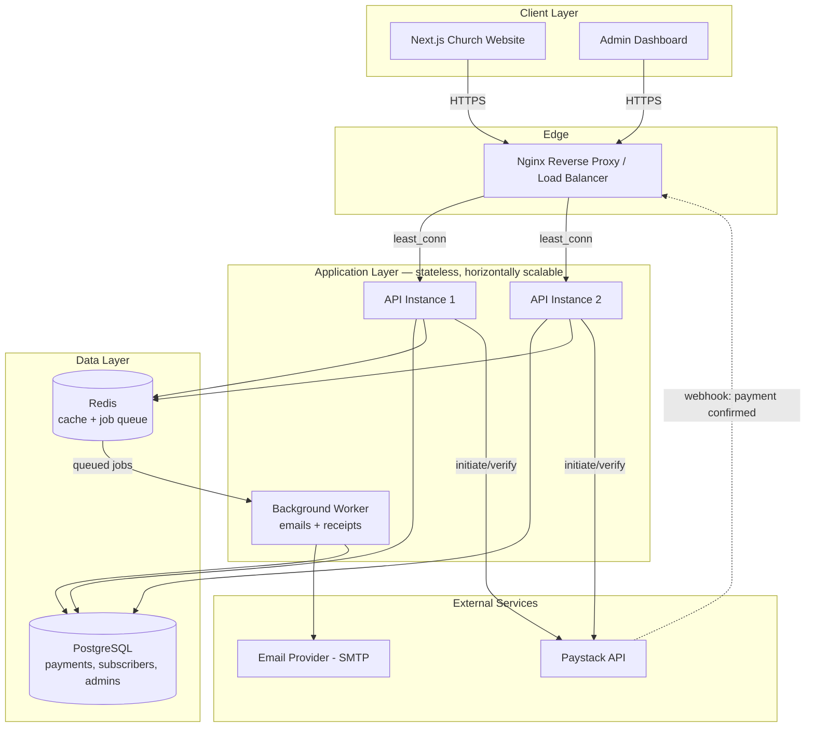

# ⛪ Church Backend API — Newsletter & Payments Service

A focused, production-grade backend that powers two things for a church website: **online giving (payments)** and **email newsletters / announcements**. It's built to sit behind a **Next.js** frontend as a standalone API — the frontend never talks to Paystack or your SMTP provider directly; it talks to this service, and this service does the hard part.

This README is written so that **two different people can both use it successfully**:
- A **developer** picking up the codebase for the first time.
- A **non-technical church staff member or admin** who just needs to know "what do I click / who do I call" when something looks wrong.

Wherever a section is developer-only, it's marked 🧑‍💻. Wherever it's for anyone, it's marked 🙋.

---

## 📋 Table of Contents

1. [🙋 What This System Actually Does](#-what-this-system-actually-does)
2. [🙋 How It Fits With the Next.js Frontend](#-how-it-fits-with-the-nextjs-frontend)
3. [🧑‍💻 Tech Stack & Why](#-tech-stack--why)
4. [🧑‍💻 Architecture — How a Request Flows](#-architecture--how-a-request-flows)
5. [🧑‍💻 Recommended Folder Structure](#-recommended-folder-structure)
6. [🧑‍💻 Getting Started](#-getting-started)
7. [🧑‍💻 Environment Variables](#-environment-variables)
8. [🧑‍💻 API Reference](#-api-reference)
9. [🙋 How Payments Work, Step by Step](#-how-payments-work-step-by-step)
10. [🙋 How Newsletters Work, Step by Step](#-how-newsletters-work-step-by-step)
11. [🧑‍💻 Security](#-security)
12. [🧑‍💻 Scaling This Beyond a Single Church](#-scaling-this-beyond-a-single-church)
13. [🙋 Troubleshooting — "Something Looks Wrong, What Do I Do?"](#-troubleshooting--something-looks-wrong-what-do-i-do)
14. [🧑‍💻 How to Add a New Feature](#-how-to-add-a-new-feature)
15. [🧑‍💻 Deployment](#-deployment)
16. [🧑‍💻 Testing](#-testing)
17. [🗺 Roadmap](#-roadmap)
18. [🤝 Contributing](#-contributing)

---

## 🙋 What This System Actually Does

In plain language, this backend does exactly two jobs — nothing more:

1. **Takes money online, safely.** Someone on the church website chooses to give a tithe, an offering, a donation, or pay for an event ticket. This service hands them off to **Paystack** (a trusted African payment processor) to actually enter their card or mobile money details — this backend never sees or stores card numbers. Once Paystack confirms the payment, the giver gets an automatic email receipt and the church has a permanent record.

2. **Sends emails to the congregation, without breaking a sweat.** An admin writes a newsletter or announcement once, hits send, and this service delivers it to every subscriber on the list — whether that's 20 people or 5,000 — without the website freezing up while it happens.

That's it. There's no member login system, no event RSVP, no prayer request wall in this service — those either live in the Next.js frontend directly (as static/CMS content) or are a separate concern. Keeping this backend's job list short is intentional: **a smaller service is easier to secure, easier to debug, and easier to hand off to the next developer.**

---

## 🙋 How It Fits With the Next.js Frontend

```
┌─────────────────────┐        HTTPS / JSON        ┌──────────────────────────┐
│   Next.js Frontend   │ ──────────────────────────▶│   This Backend (API)     │
│  (church website)    │ ◀──────────────────────────│  Node.js + Express       │
└─────────────────────┘                             └──────────────────────────┘
```

- The Next.js app is the **public-facing website** — pages, design, content.
- This backend is a **separate deployment**, reachable only through its API (e.g. `https://api.yourchurch.org`).
- The frontend calls endpoints like `POST /api/v1/payments/initiate` or `POST /api/v1/newsletter/subscribe` using `fetch`/`axios`, the same way it would call any third-party API.
- Because they're separate deployments, they can be updated, restarted, and scaled independently — a slow newsletter send never slows down the website, and a frontend redesign never requires touching payment logic.
- `CORS_ALLOWED_ORIGINS` in this backend's `.env` must include your Next.js domain(s) (e.g. `https://yourchurch.org`, `http://localhost:3000` for local dev) or the browser will block the requests.

---

## 🧑‍💻 Tech Stack & Why

| Layer | Technology | Why this, specifically |
|---|---|---|
| Runtime | **Node.js 18+ LTS** | Non-blocking I/O — ideal for a service that spends most of its time waiting on Postgres, Redis, Paystack, and SMTP rather than doing heavy computation. |
| Web framework | **Express.js** | Minimal, extremely well understood, huge ecosystem of security middleware — the right level of "boring" for a payments-adjacent service. |
| Database | **PostgreSQL 16** | Payments and subscribers are relational data with real constraints. Postgres gives you ACID transactions, which matter when money and "was this email already sent" are involved. |
| ORM | **Prisma** | Type-safe queries, auto-generated migrations, and a schema file (`schema.prisma`) that doubles as living documentation of every table in the system. |
| Cache & Queue backing | **Redis** | Two jobs: (1) caching cheap-to-serve public data like the current newsletter subscriber count, and (2) backing the background job queue below. |
| Job Queue | **BullMQ** | Every newsletter send and every payment receipt email is handed to a background worker instead of being sent inline — so an API request never blocks waiting on SMTP. |
| Payments | **Paystack** | Card, mobile money, and bank transfer support suited to a Ghana / West-Africa congregation. |
| Auth (admin only) | **JWT (access + refresh) + Argon2** | A small number of admin/staff accounts need to log in to send newsletters and view payment records — this doesn't need the weight of a full member-auth system. |
| Validation | **Zod** | Every request body is validated at the edge before it touches business logic. |
| Logging | **Pino** | Structured JSON logs — readable by a human locally, and parseable by a log aggregator in production. |
| Containerization | **Docker + Docker Compose** | One command gets any collaborator an identical local environment — no "works on my machine." |
| Package manager | **Yarn** | Whole repo assumes `yarn`; keep it consistent. |

### 📦 Recommended packages to install

Everything below is either already necessary for the stack above, or a well-maintained addition that pays for itself on a payments/email service:

```bash
# Core
yarn add express cors helmet compression morgan dotenv
yarn add @prisma/client && yarn add -D prisma
yarn add ioredis bullmq
yarn add zod
yarn add argon2 jsonwebtoken cookie-parser
yarn add pino pino-http pino-pretty

# Payments
yarn add axios              # calling the Paystack REST API

# Email
yarn add nodemailer         # SMTP sending from the worker process
yarn add handlebars         # optional — templated HTML emails without hand-built strings

# Rate limiting & hardening
yarn add express-rate-limit rate-limit-redis
yarn add hpp express-mongo-sanitize xss-clean

# Dev tooling
yarn add -D nodemon eslint prettier jest supertest
yarn add -D @faker-js/faker  # generating realistic seed/test data
```

Nothing here is exotic — that's deliberate. Every package is either the de-facto standard for its job or a thin, well-audited wrapper around it.

---

## 🧑‍💻 Architecture — How a Request Flows



**In words, step by step:**

1. A request from the website or the admin dashboard hits **Nginx**, which forwards it to whichever API instance currently has the fewest active connections.
2. If the request is a **read** for something cheap and frequently requested (e.g. "is the newsletter list open for subscriptions"), Redis serves it from cache when possible.
3. If the request is a **write** — a new payment, a new subscriber, a newsletter send request — it goes to **PostgreSQL** inside a database transaction, so a half-finished write can never leave the data in a broken state.
4. Anything that involves **sending an email** is never done inline. It's placed on a **Redis/BullMQ queue** and picked up by a separate **worker process**, so the person on the website gets an instant response instead of waiting on SMTP.
5. **Payments** are handed off to Paystack's hosted checkout. Paystack confirms success by calling back to this backend's webhook endpoint, and that callback's signature is verified before anything is trusted.

---

## 🧑‍💻 Recommended Folder Structure

A newsletter-and-payments-only service should stay small and obvious. Every folder answers one question: "where does X live?"

```
church-backend/
├── src/
│   ├── config/                     # env loading, database client, redis client, logger setup
│   │   ├── env.js
│   │   ├── db.js
│   │   ├── redis.js
│   │   └── logger.js
│   │
│   ├── middleware/
│   │   ├── auth.middleware.js      # verifies admin JWTs on protected routes
│   │   ├── error.middleware.js     # single place that turns errors into JSON responses
│   │   ├── rateLimit.middleware.js
│   │   └── validate.middleware.js  # wraps a Zod schema into Express middleware
│   │
│   ├── modules/
│   │   ├── auth/                   # admin login only — no member accounts
│   │   │   ├── auth.routes.js
│   │   │   ├── auth.controller.js
│   │   │   ├── auth.service.js
│   │   │   └── auth.validation.js
│   │   │
│   │   ├── payments/
│   │   │   ├── payments.routes.js
│   │   │   ├── payments.controller.js
│   │   │   ├── payments.service.js     # talks to Paystack
│   │   │   ├── payments.webhook.js     # signature verification + event handling
│   │   │   └── payments.validation.js
│   │   │
│   │   └── newsletter/
│   │       ├── newsletter.routes.js
│   │       ├── newsletter.controller.js
│   │       ├── newsletter.service.js
│   │       ├── newsletter.validation.js
│   │       └── templates/
│   │           ├── newsletter.template.js
│   │           └── receipt.template.js
│   │
│   ├── jobs/
│   │   ├── queue.js                 # BullMQ queue definitions
│   │   └── workers/
│   │       ├── email.worker.js      # sends newsletters + receipts
│   │       └── index.js             # entry point for `yarn worker`
│   │
│   ├── utils/
│   │   ├── apiResponse.js           # consistent { success, message, data } shape
│   │   └── asyncHandler.js
│   │
│   ├── app.js                       # Express app: middleware + routes wired up, no listen()
│   ├── routes.js                    # mounts every module's router under /api/v1
│   └── server.js                    # actually calls app.listen()
│
├── prisma/
│   ├── schema.prisma                # Payment, Subscriber, AdminUser models
│   └── seed.js
│
├── docker/
│   ├── Dockerfile
│   └── nginx.conf
│
├── tests/
│   ├── payments.test.js
│   └── newsletter.test.js
│
├── .github/workflows/ci.yml
├── docker-compose.yml
├── .env.example
└── README.md
```

**Why this shape, specifically:**
- **One folder per business capability** (`payments/`, `newsletter/`, `auth/`) instead of one folder per file-type (`controllers/`, `routes/`, `services/`) — when you're fixing a payment bug, everything relevant is in one place, not scattered across five folders.
- **`jobs/` is separate from `modules/`** because background work has a different lifecycle (it runs in its own process via `yarn worker`) from request/response code.
- **`app.js` and `server.js` are split** so tests can import `app.js` and hit it with Supertest without actually binding a port.

---

## 🧑‍💻 Getting Started

### Prerequisites
- [Node.js 18+](https://nodejs.org)
- [Yarn](https://yarnpkg.com)
- [Docker & Docker Compose](https://www.docker.com/products/docker-desktop) (recommended)
- A free [Paystack test account](https://dashboard.paystack.com/#/signup)
- An SMTP provider — SendGrid, Mailgun, Amazon SES, or a Gmail App Password for local testing

### Option A — Docker (recommended)

```bash
git clone <your-repo-url>
cd church-backend

cp .env.example .env
# fill in Paystack keys, SMTP credentials, and generate random secrets for
# JWT_ACCESS_SECRET / JWT_REFRESH_SECRET / COOKIE_SECRET

docker compose up --build

# in a new terminal — apply migrations and seed an admin account
docker compose exec api yarn prisma:deploy
docker compose exec api yarn seed
```

API is live at `http://localhost`. Check it worked:
```bash
curl http://localhost/health
# → {"status":"ok"}
```

### Option B — Local, without Docker

```bash
yarn install
cp .env.example .env
yarn prisma:migrate
yarn seed

yarn dev            # API with hot-reload, http://localhost:5000

# second terminal — required for newsletters and receipts to actually send
yarn worker
```

### 💡 Generating strong secrets
```bash
node -e "console.log(require('crypto').randomBytes(64).toString('hex'))"
```
Run this once per secret in `.env`. Never reuse a secret across `JWT_ACCESS_SECRET`, `JWT_REFRESH_SECRET`, and `COOKIE_SECRET`.

---

## 🧑‍💻 Environment Variables

| Variable | Purpose |
|---|---|
| `DATABASE_URL` | PostgreSQL connection string (Prisma format) |
| `REDIS_URL` | Redis connection string — powers caching and the job queue |
| `JWT_ACCESS_SECRET` / `JWT_REFRESH_SECRET` | Signing secrets for admin login sessions |
| `PAYSTACK_SECRET_KEY` / `PAYSTACK_PUBLIC_KEY` | From your Paystack dashboard — test keys for development, live keys for production |
| `SMTP_HOST` / `SMTP_PORT` / `SMTP_USER` / `SMTP_PASS` | Your email provider's credentials |
| `CORS_ALLOWED_ORIGINS` | Comma-separated list of frontend domains allowed to call this API (must include your Next.js domain) |
| `RATE_LIMIT_WINDOW_MS` / `RATE_LIMIT_MAX` | General API rate-limit tuning |

All variables are documented in `.env.example`. Never commit your real `.env` file — it's already in `.gitignore`.

---

## 🧑‍💻 API Reference

Base URL: `/api/v1`. Every response follows the same shape:
```json
{ "success": true, "message": "...", "data": { } }
```

| Method | Endpoint | Auth | Description |
|---|---|---|---|
| GET | `/health` | Public | Confirms the API and its dependencies are up |
| POST | `/auth/login` | Public | Admin login — returns an access token, sets a refresh cookie |
| POST | `/auth/refresh` | Cookie | Exchanges a valid refresh cookie for a new access token |
| POST | `/auth/logout` | Admin | Invalidates the current refresh token |
| POST | `/payments/initiate` | Public | Starts a payment (tithe/offering/donation/event-ticket), returns a Paystack checkout URL |
| GET | `/payments/verify/:reference` | Public | Checks the status of a specific transaction |
| POST | `/payments/webhook` | Paystack only (signature-verified) | Receives payment confirmation events from Paystack |
| GET | `/payments` | Admin | Paginated, filterable list of all payments |
| POST | `/newsletter/subscribe` | Public | Adds an email to the newsletter list (with confirmation email) |
| POST | `/newsletter/unsubscribe` | Public | Removes an email from the list via a signed unsubscribe link |
| GET | `/newsletter/subscribers` | Admin | Paginated list of current subscribers |
| POST | `/newsletter/send` | Admin | Queues a newsletter/announcement to every active subscriber |
| GET | `/newsletter/campaigns/:id` | Admin | Delivery status of a past newsletter send |

---

## 🙋 How Payments Work, Step by Step

1. **Someone clicks "Give"** on the website and picks an amount and a purpose (tithe, offering, donation, event ticket).
2. The website asks this backend to **start** the payment. The backend talks to Paystack and gets back a secure checkout link.
3. The **giver is sent to Paystack's own page** to type in their card or mobile money details — this backend and the church website never see or store that information, which is exactly how it should be.
4. Once Paystack confirms the money moved, it **automatically notifies this backend** in the background (a "webhook"). This backend double-checks that the notification genuinely came from Paystack before trusting it, using a cryptographic signature.
5. The giver instantly gets an **email receipt**, and the payment appears in the admin's payment records.
6. If Paystack's confirmation happens to arrive twice (which can genuinely happen on their end), this backend recognizes the duplicate and **will not** create two records or send two receipts.

---

## 🙋 How Newsletters Work, Step by Step

1. Someone visits the website and enters their email to **subscribe**. They get a short confirmation email so a mistyped address can't end up on the list.
2. An **admin** logs into the dashboard, writes an announcement, and hits **Send**.
3. The backend doesn't try to email everyone at once — that would slow the whole system down. Instead, it **queues one job per recipient (or per batch)** and a separate background worker sends them out steadily, respecting the email provider's sending limits.
4. The admin can check **delivery status** afterward — how many sent, how many bounced.
5. Every outgoing email includes a **one-click unsubscribe link**, and anyone who unsubscribes is immediately removed from future sends.

---

## 🧑‍💻 Security

- **Helmet** — sets 15+ secure HTTP headers by default.
- **CORS whitelist** — only origins listed in `CORS_ALLOWED_ORIGINS` can call the API from a browser.
- **Redis-backed rate limiting** — general limits everywhere; stricter limits on `/auth/*` and `/payments/initiate`.
- **Argon2id** for admin password hashing — deliberately slow to brute-force, industry standard.
- **JWT access + refresh tokens** — short-lived access tokens, `httpOnly` refresh cookies (never readable by JavaScript, so an XSS bug can't steal them).
- **Zod validation** on every request body, query, and param — malformed input is rejected before it reaches business logic.
- **Webhook signature verification** — every Paystack callback is verified with HMAC-SHA512 against the raw request body before it's trusted.
- **Idempotent payment processing** — a Redis lock keyed on the Paystack event ID prevents duplicate records from a repeated webhook.
- **Input sanitization** (HPP, XSS) and a **10kb payload cap** on incoming requests.
- **Non-root Docker container** and **environment validation at boot** — the app refuses to start with a missing or malformed `.env`.

### Recommended before going fully live
- A Web Application Firewall in front of Nginx (Cloudflare's free tier is enough to start)
- `yarn audit` in CI, or GitHub Dependabot, for dependency vulnerability scanning
- Scheduled, encrypted database backups
- A second admin 2FA step (email OTP) if the admin dashboard is ever exposed beyond a trusted, small group — worth revisiting if the number of admins grows

---

## 🧑‍💻 Scaling This Beyond a Single Church

The current stack (Node + Express + Postgres + Redis) comfortably handles a single church, even a large one, with room to spare. If this ever needs to serve **multiple churches / a multi-tenant platform**, or traffic spikes hard (e.g. a viral fundraising campaign), here's the upgrade path — in the order you'd actually need it:

| Need | Add |
|---|---|
| More API throughput | Run more stateless API instances behind Nginx (already supported — no code changes) |
| Database becoming the bottleneck | **PgBouncer** for connection pooling; a **read replica** for reporting/analytics queries |
| Newsletter volume grows past a few thousand recipients | Move from a generic SMTP provider to a **bulk-email API** (SendGrid, Postmark, Amazon SES) with native batch endpoints; keep BullMQ as the orchestrator |
| Multiple regions / high availability | Managed Postgres with **Multi-AZ** (RDS, or Neon/Supabase equivalents) and managed Redis (ElastiCache, Upstash) |
| File/media needs appear later (receipts as PDFs, sermon uploads, etc.) | **Amazon S3 + CloudFront** rather than storing files on the API server |
| Observability at scale | Structured logs (already via Pino) shipped to a log aggregator (e.g. Grafana Loki, Datadog); add **OpenTelemetry** tracing across API → worker → Paystack/SMTP calls |
| True multi-tenant SaaS | Add a `Church`/`Tenant` table and scope every query by tenant ID; consider **schema-per-tenant** in Postgres if data isolation requirements grow strict |

None of these are needed on day one — the point of listing them here is so a future developer (or you, in a year) knows the next lever to pull instead of guessing.

---

## 🙋 Troubleshooting — "Something Looks Wrong, What Do I Do?"

You don't need to read code to use this section. Find the symptom, follow the steps.

**"A giver says they paid but I don't see it in the admin dashboard."**
1. Ask them for the payment reference/receipt email — check `GET /payments/verify/:reference` (a developer can run this) to see what Paystack itself says happened.
2. Check the Paystack dashboard directly — if Paystack shows it as successful but it's missing here, the webhook likely didn't arrive; a developer should check the worker/API logs around that timestamp.
3. This is never a "did we lose the money" problem — Paystack is the source of truth for whether the transaction succeeded. This backend is just the record-keeper on our side.

**"The newsletter says it's sending but nobody's received it after 30+ minutes."**
1. Confirm the background worker process (`yarn worker`) is actually running — if only the API is up and the worker isn't, jobs pile up in the queue but never send.
2. Check the campaign's delivery status via `GET /newsletter/campaigns/:id` — it will show partial progress if it's working, or zero progress if the worker is down.
3. Check the SMTP provider's dashboard for bounces or a paused account (providers pause sending if you hit their reputation/rate limits).

**"I can't log into the admin dashboard."**
1. Confirm you're using the right environment (production vs. a developer's local setup).
2. Password resets aren't self-service yet (see Roadmap) — a developer with database access needs to reset it directly, or reseed in a dev environment.

**"The website shows an error when someone tries to give or subscribe."**
1. Check `GET /health` — if that's down, the whole API is down, and it's an infrastructure issue (check the hosting provider's status page first).
2. If `/health` is fine but one specific action fails, it's almost always one of: Paystack keys expired/wrong, SMTP credentials wrong, or a database connection issue — a developer should check the logs for the exact error rather than guessing.

**General rule for anyone, technical or not:** the logs (Pino output, or your hosting provider's log viewer) almost always say exactly what went wrong in plain English. When asking a developer for help, screenshotting or pasting the exact error text saves everyone time.

---

## 🧑‍💻 How to Add a New Feature

1. **Decide if it's payments, newsletter, or genuinely new.** If it's neither, give it its own folder under `src/modules/your-feature/`, following the same internal shape (`*.routes.js`, `*.controller.js`, `*.service.js`, `*.validation.js`).
2. **Model the data first.** Add or update the relevant model in `prisma/schema.prisma`, then run:
   ```bash
   yarn prisma migrate dev --name add_your_feature
   ```
3. **Write the Zod schema** for any request body before writing the controller — it forces you to define the contract up front.
4. **Wire the router** into `src/routes.js`.
5. **If it sends any email**, add a job type in `src/jobs/queue.js` and a handler in `src/jobs/workers/email.worker.js` — never send email inline from a controller.
6. **Write a test** in `tests/` covering the happy path and at least one failure case, then `yarn test`.
7. **Update this README's [API Reference](#-api-reference) table** — a route that isn't documented here doesn't really exist as far as the next developer is concerned.

---

## 🧑‍💻 Deployment

### Railway or Render (recommended for a church-sized budget)

1. Push the repo to GitHub.
2. Create a project → "Deploy from GitHub repo."
3. Add **PostgreSQL** and **Redis** add-ons; copy the connection strings into `DATABASE_URL` / `REDIS_URL`.
4. Set every variable from `.env.example`.
5. Build command: `yarn install && yarn prisma:generate`. Start command: `yarn prisma:deploy && yarn start`.
6. Deploy a **second service** running `yarn worker` — newsletters and receipts won't send without it.
7. Point your Paystack webhook URL to `https://your-deployed-domain.com/api/v1/payments/webhook`.

### AWS (larger scale)
- **Compute:** ECS Fargate behind an Application Load Balancer.
- **Database:** RDS for PostgreSQL (Multi-AZ when budget allows).
- **Cache/Queue:** ElastiCache for Redis.
- **Worker:** separate ECS service, scaled on queue depth.
- **Secrets:** AWS Secrets Manager instead of a plain `.env`.

### Production checklist
- [ ] Real Paystack keys, webhook URL registered
- [ ] `NODE_ENV=production`
- [ ] Strong, unique value for every secret
- [ ] HTTPS enforced
- [ ] Database backups scheduled
- [ ] `yarn prisma:deploy` run before first traffic
- [ ] Worker process confirmed running and healthy, separately from the API
- [ ] SMTP provider's sending limits confirmed to cover expected newsletter volume

---

## 🧑‍💻 Testing

```bash
yarn test         # Jest + Supertest — payments and newsletter flows
yarn lint
yarn lint:fix
```

CI (`.github/workflows/ci.yml`) runs both on every push/PR against real Postgres and Redis service containers, so tests reflect production behavior rather than mocks.

---

## 🗺 Roadmap

- [ ] Self-service admin password reset
- [ ] Optional email OTP for admin login as the admin group grows
- [ ] Newsletter open/click tracking
- [ ] Recurring/scheduled giving (subscriptions via Paystack)
- [ ] Admin analytics dashboard (giving trends, subscriber growth)
- [ ] Multi-language newsletter templates

---

## 🤝 Contributing

1. Branch off `develop`: `git checkout -b feature/your-feature-name`
2. Follow the existing module structure — new features get their own folder under `src/modules/`
3. Run `yarn lint` and `yarn test` before opening a pull request
4. Open a PR into `develop` with a clear description

New to the codebase? Start with `prisma/schema.prisma` (the full data model), `src/app.js` (the request pipeline), and whichever of `src/modules/payments/` or `src/modules/newsletter/` matches what you're working on.

---

## 📄 License

MIT — free to use and adapt for your ministry.
